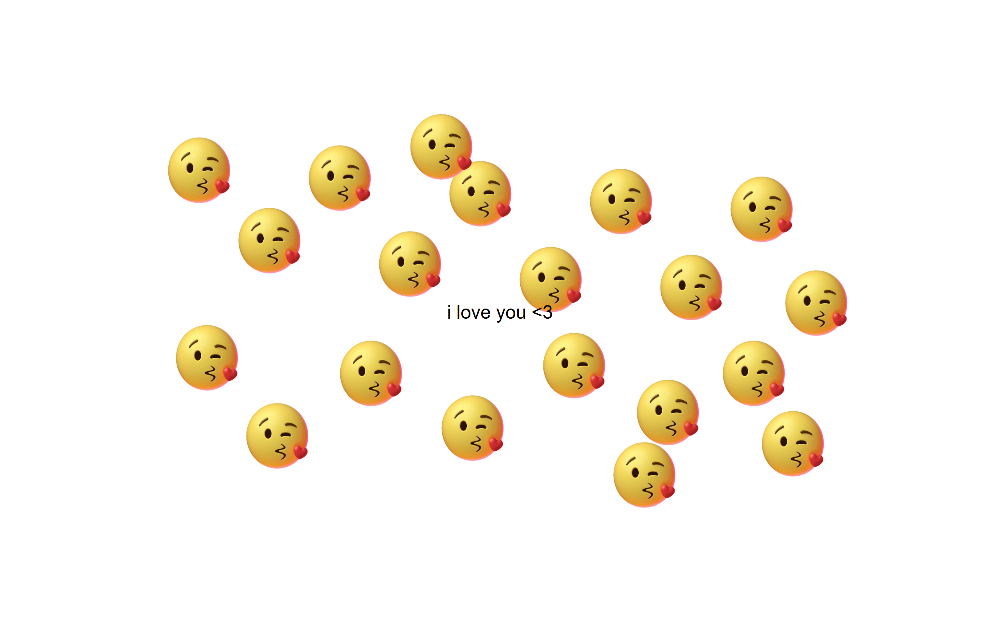

# Kisses 💋

A tiny website that showers the screen with kisses wherever you click.

## Why does this exist?

Because sometimes you just want to send someone a page that kisses them back. No login, no database, no framework.

## How it works

- Click anywhere and a kiss appears right at your cursor.
- Hold the mouse down and drag to leave a whole trail of them.
- Each kiss fades out after a second and is removed from the DOM after two, so the page never gets heavy no matter how long you spam it.

The centered `i love you <3` text sits underneath everything with `pointer-events: none`, so it never blocks a click.

## Built with

Plain HTML, CSS, and vanilla JavaScript. No libraries, no build step. One file and one GIF.

## Live demo

[gianneangely.github.io/Kisses](https://gianneangely.github.io/Kisses/)

## Note

Best on desktop, since the trail effect is driven by `mousedown` and `mousemove`. On touch screens you still get a kiss per tap, just no dragging.
